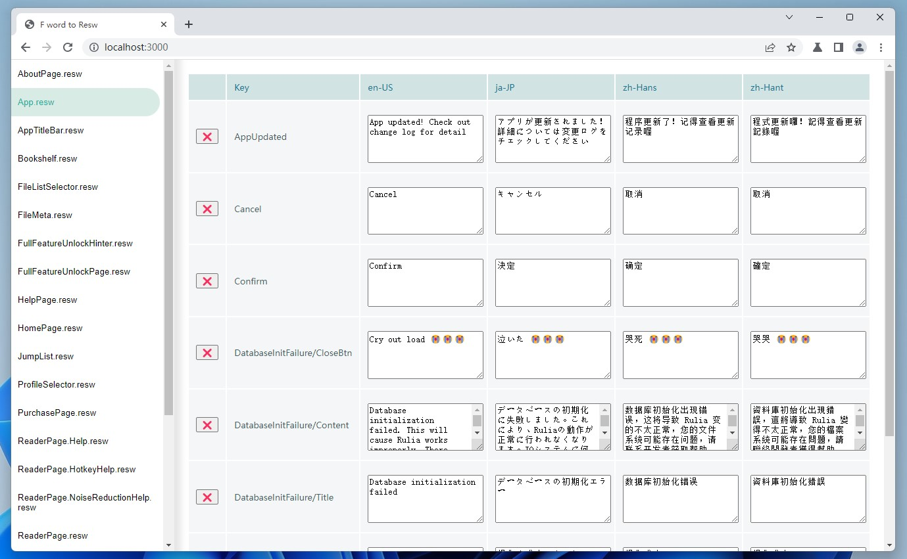

# F word to Resw



This is a tiny tool to manage the `resw` files in .net projects.

I hate managing resw.

## Usage

 - npm install
 - Create a `.env` file and update its setting.
 - npm start

## Env file

Please create a `.env` file:

```
HOST=0.0.0.0
PORT=3000
STRING_FOLDER_PATH=C:\SOME_PATH\TO\YOUR\STRING\FOLDER
OPEN_AI_KEY=YOUR_OPEN_AI_KEY
OPEN_AI_ORG=YOUR_OEPN_AI_ORG_ID
```

`STRING_FOLDER_PATH` points to the `Strings` folder in your .NET project.

If you don't use the ChatGPT translation, you don't need to fill the OpenAI thing.

## Notice

### Build quality

This thing was poorly built. It was just designed for my UWP project and didn't have any further test.

### File preparation

You have to make sure file structure in every single lang folder are same.

If not, create resw files first in Visual Studio and then come back.

If you want to add a new language, just create that lang folder and copy resw files from some other language as templates then edit them in F-word. 
